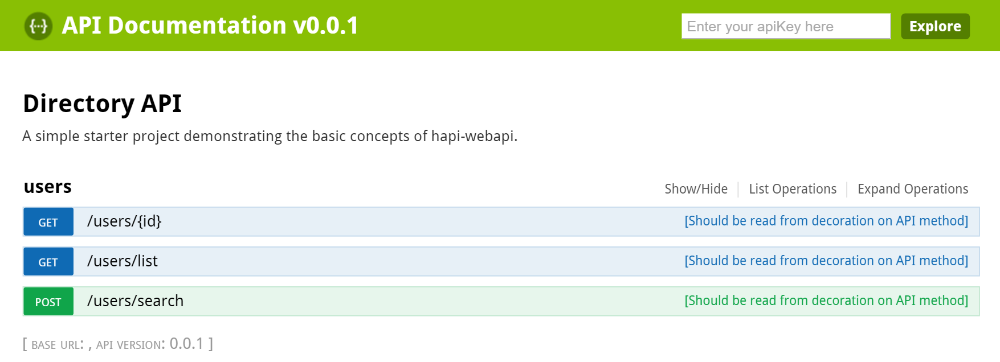

# hapi-webapi-seed
A simple starter project demonstrating the basic concepts of hapi-webapi.

# Get started

Clone the repo: 

`git clone https://github.com/sondreb/hapi-webapi-seed.git`

Navigate to the repo folder and run these commands:

`npm run setup`

This will run npm install and typings install.

Then run the following command to compile the project:

`npm run build`

Now you can launch the project and web server:

`npm run start`

The console will output all registered API routes and server URL.

Standard URLs are:

* http://localhost:4600/swagger (Swagger UI)
* http://localhost:4600/docs (Swagger definition)
* http://localhost:4600/users/list (Simple API example URL)

Screenshot of the Swagger UI that is accessible through the hapi-webapi:

# Learn more

Visit the [hapi-webapi](https://github.com/sondreb/hapi-webapi) repository to learn more on how to use hapi-webapi.

## License
    
MIT © [Sondre Bjellås](http://sondreb.com)